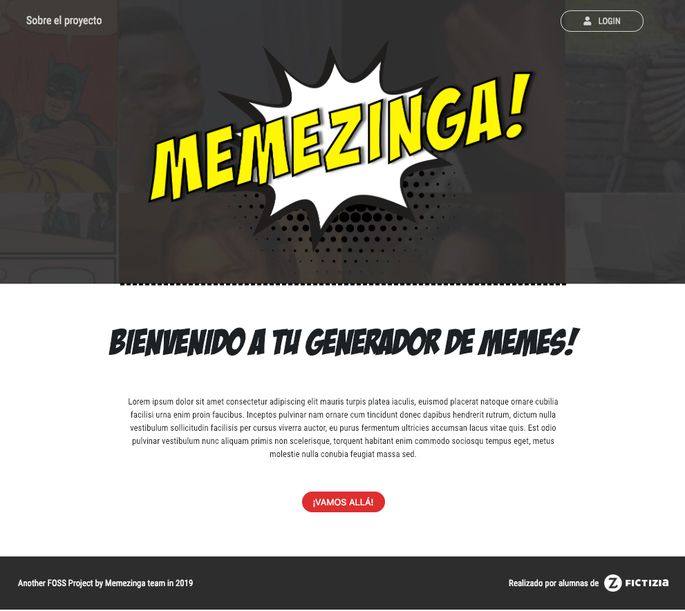

# Memezinga
An amazing Open Source meme's generator!
We're working on the release v2.0.0. 

### How it works
- Step 1: start by choosing the best meme for your purpose from the gallery
- Step 2: add texts and colour it as you wish!
- Step 3: download it locally and use it everywhere! You can also log in with your GitHub account and have access to your favorites memes!

### Features and dependencies
- Code documented with JsDocs
- Style guidelines by [Udacity](http://udacity.github.io/frontend-nanodegree-styleguide/javascript.html)
- Google fonts and font awesome used
- We worked with Git flow
- All the data is storaged in Firebase 
- Yeomann and Gulp has been used
- Design: Boostrap and Sass

Contributors:
- [Fabiola Vieyra](https://github.com/Fa-v)
- [Theba Gomez](https://github.com/KoolTheba)
- [Ulises Gascón](https://github.com/UlisesGascon)
- [Leyla Vieira](https://github.com/LeylaVieira)
